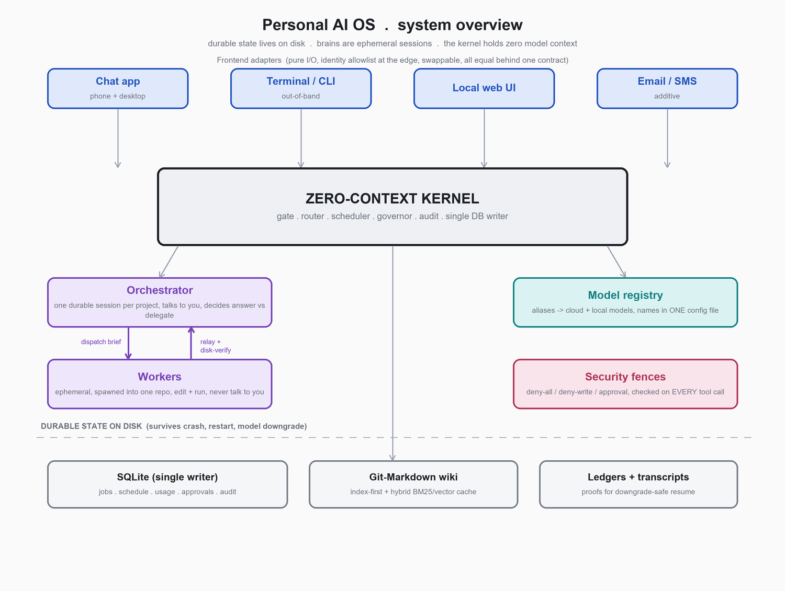
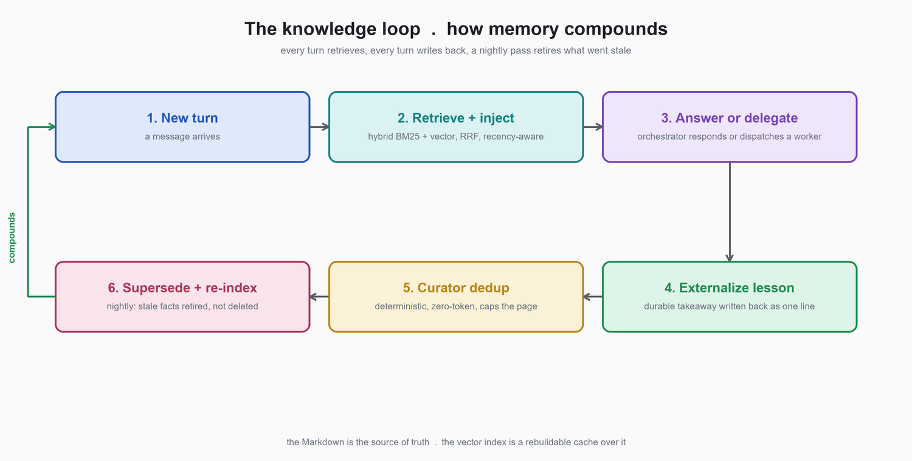
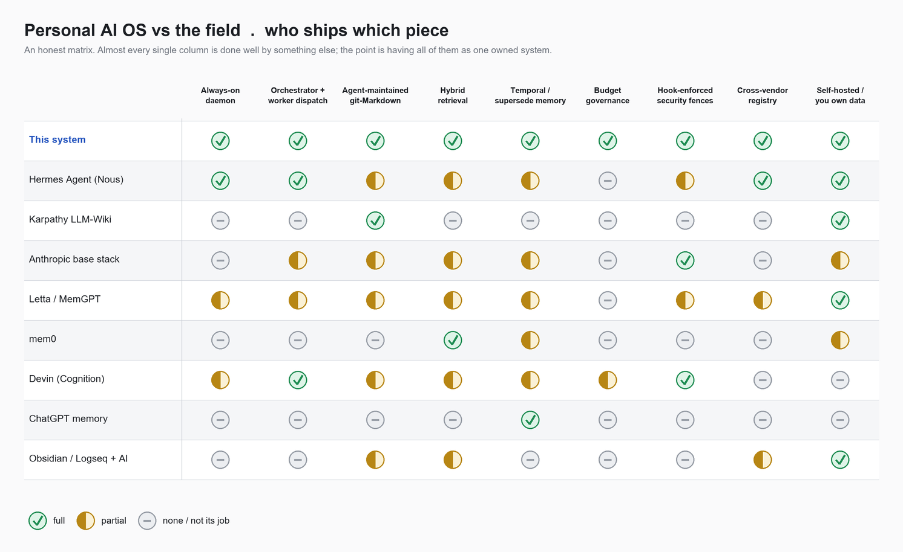

# Personal AI OS

**Build your own always-on AI agent that dispatches coding tasks across your repositories, maintains its own git-Markdown knowledge base, and runs on hardware you own. This is a vendor-neutral blueprint you paste into any coding agent (Claude Code, Codex, Cursor, an agent SDK, or a plain API loop) and it builds the system with you, asking at every design decision.**

If this blueprint is useful to you, a star helps other people find it.

---

## What this is

A single Markdown file, [`BUILD-GUIDE.md`](BUILD-GUIDE.md), that describes how to build a persistent, self-hosted personal AI operating system, and an agent protocol that makes your coding agent build it with you rather than dumping a fixed stack on you.

It is not a framework or a package to install. It is a compiled architecture: the pillars, the decision forks, the security model, nineteen hard-won failure modes to design against, and a milestone build order where every step is proven with real output before it counts as done. You bring the coding agent. The guide tells it to stop and ask you at every fork (which chat app, which model vendor, which database, how much access to grant an autonomous agent) so the result matches your machine, your budget, and your risk tolerance.

The core idea in one line: durable state lives in files and a database, the brains are ephemeral sessions, and a small boring kernel coordinates everything and holds zero model context. Nothing a model remembers survives a single session, so a crash or a restart or a model downgrade loses no durable state.

## Who this is for

- Developers who want an AI agent that is reachable from a phone, keeps working after they disconnect, and remembers what it learned last week.
- People who want to own and audit their AI memory as plain Markdown in git, instead of an opaque cloud memory blob.
- Anyone who has hit the wall with a stateless chat agent and wants dispatch, budget control, and a real security model around an autonomous agent that can touch their repositories.
- Builders comparing agent-memory and long-running-agent options (Letta, mem0, Hermes Agent, LangGraph, AutoGPT) who want to understand the whole system rather than only the memory layer.

## Quickstart

1. Open [`BUILD-GUIDE.md`](BUILD-GUIDE.md).
2. Paste the entire file into the coding agent of your choice and say: "Help me build this. Follow the agent protocol at the top."
3. Answer the questions it asks at each design fork. It writes your choices into a `DECISIONS.md` and builds in milestones, proving each one with real output.

A reasonable minimum viable cut of the system lands about halfway through the milestones. You do not have to build all of it.

**Try it now:** the [`starter/`](starter/) folder is a runnable, stdlib-only reference for Milestones M0 and M1 (kernel, single-instance lock, heartbeat, watchdog, the gate, and the control CLI). Clone it and run `python osctl.py start && python osctl.py status`.

## The architecture at a glance

Twelve pillars, each with the decision forks your agent will ask you about:

- **Zero-context kernel.** A small always-on supervisor process (watchdog, heartbeat, internal cron) that holds no model context and coordinates everything.
- **Persistence layers.** An operational database plus git-Markdown knowledge plus progress ledgers, ordered by authority so anything can be rebuilt.
- **Frontend adapters.** A chat app, a CLI, a web UI, email, or a messaging bridge, all swappable behind one contract. No single platform is assumed.
- **Agent harness seam.** One module builds every model session so the harness (an agent SDK, a coding-agent CLI, or a raw API loop) can be swapped in one place.
- **Security.** A permission hook checks every tool call against path fences. The model is never trusted to police itself. Dangerous actions need an out-of-band approval code.
- **Capability model registry.** Aliases like cheap, workhorse, and deep map to concrete models across vendors, with model names in one config file.
- **Orchestrator and workers.** A conversational orchestrator decides and delegates. Ephemeral workers do real edits inside a repo and never talk to you.
- **Compiled knowledge.** A git-Markdown wiki the agent maintains as a librarian, with index-first retrieval and optional hybrid keyword plus vector search.
- **Providers and execution engines.** A uniform contract over cloud models, local models, and foreign CLIs, returning typed results and never raising.
- **Budget governor.** Usage accounting and a degrade-then-pause ladder so autonomous work never burns your quota.
- **Scheduling.** A reboot-safe internal cron for backups, consolidation, digests, and health checks.
- **Operations surface.** A local control CLI, a security audit log, and a nightly regression eval with a safety canary.

## How this compares to other agent and memory systems

None of the individual ideas here are new. Almost every single piece exists as a more mature product or library. The value is having all of them as one owned, transparent, always-on system. Here is an honest map of the field so you can decide what to build versus what to adopt.

| Project | What it is | How this blueprint relates |
|---|---|---|
| **Hermes Agent** (Nous Research) | Open-source always-on agent with a daemon, multi-platform gateway, and skills | Closest comparable. If you want most of this without building it, start there. This guide goes further on hybrid retrieval and a git-Markdown librarian. |
| **Karpathy's LLM Wiki / LLM OS** | The conceptual pattern of an agent compiling knowledge into a Markdown wiki, and the LLM-as-kernel mental model | This is a production instantiation of that pattern, with hybrid retrieval added on top and a full OS around it. |
| **Anthropic base stack** (Claude Agent SDK, Claude Code, memory tool, Projects) | Primitives for agent memory, subagents, and hook-enforced permissions | Great building blocks. This guide is the assembled system the base does not give you: an owned daemon, an orchestrator, retrieval you control, and a budget governor. |
| **Letta / MemGPT** | Stateful-agent runtime with tiered, now git-backed, memory | The closest cousin on memory, and in some ways ahead. This wraps a whole always-on OS around the memory core. |
| **mem0** | Drop-in memory API with hybrid retrieval | Simpler and more mature at the one job of user memory. A plausible substitute for this guide's memory layer. |
| **LangGraph / LangMem** | Memory and orchestration inside the LangChain ecosystem | A plausible substrate if you wanted to rebuild this system on a framework. |
| **AutoGPT / BabyAGI** | The original goal-loop autonomous agents | The naive ancestors of this idea, without supervision, memory discipline, budget control, or security. |
| **Devin** (Cognition) | Productized autonomous software engineer that dispatches repo work | The commercial version of the worker-dispatch layer, better resourced, without the personal orchestrator and owned knowledge base. |
| **Cursor / Windsurf** | Agentic code editors with rules and memory files | The rules-in-Markdown idea shipped to millions, interactive rather than always-on. |
| **ChatGPT memory** | Consumer cross-chat memory with background synthesis | Effortless and universal, but opaque and cloud-only. This keeps memory as inspectable Markdown you own. |
| **Obsidian / Logseq plus AI** | Plain-Markdown note vaults with AI plugins | The direct ancestor of this guide's knowledge layer, minus the autonomy. |

## FAQ

**Is this just RAG with extra steps?** Retrieval is one part. The part that is not RAG is the write side: the agent externalizes new lessons into the wiki, deduplicates them, and retires superseded facts on a schedule so the base does not rot.

**Does a Markdown wiki beat a vector database?** You use both. The Markdown is the source of truth because it is auditable, versioned, and portable across models. The vector index is a rebuildable cache over it for recall (hybrid BM25 plus vector, fused with reciprocal rank fusion).

**Why run a daemon 24/7?** So it is reachable from a phone and keeps working after you disconnect. It is cheap when idle because most tick work is deterministic and spends no tokens, and the budget governor degrades before the quota is a problem.

**An autonomous agent with repo write access sounds dangerous.** It is the right thing to worry about. The blueprint enforces every tool call in code, normalizes path fences against traversal and symlink tricks, requires an approval code for dangerous actions, and treats anything the agent reads as data rather than instructions.

**Isn't this lock-in?** The model layer is behind aliases in one config file across vendors, and the harness is a swappable seam, so you can move between an SDK, a CLI, and local models.

**What can this do that Claude Code plus a CLAUDE.md plus a cron job cannot?** It assembles the orchestrator, the frontends, the worker dispatch, the budget governor, and the librarian into one always-on system, rather than leaving you the primitives.

## Keywords and related topics

This blueprint is relevant if you are searching for any of these: personal AI assistant, AI operating system, LLM OS, autonomous AI agent, always-on AI agent, self-hosted AI agent, agent memory, long-term memory for LLMs, AI second brain, RAG, retrieval augmented generation, hybrid search, BM25 plus vector, reciprocal rank fusion, vector database alternative, agent framework, coding agent, Model Context Protocol (MCP), multi-agent orchestration, agent dispatch, Claude Code setup, Codex agent, local LLM assistant, Ollama agent, prompt injection defense, agent security, budget control for LLM agents. It is also a DIY alternative to Letta, MemGPT, mem0, Hermes Agent, LangGraph, LangMem, AutoGPT, BabyAGI, Devin, Cursor, and Windsurf.

## Contributing

Issues and pull requests are welcome. Good contributions include: a worked example of one milestone on a specific stack, a new decision fork the guide missed, a failure mode to add to the anti-patterns, or a translation. See [CONTRIBUTING.md](CONTRIBUTING.md).

## License

MIT. Use it, fork it, build on it, sell what you build with it.
